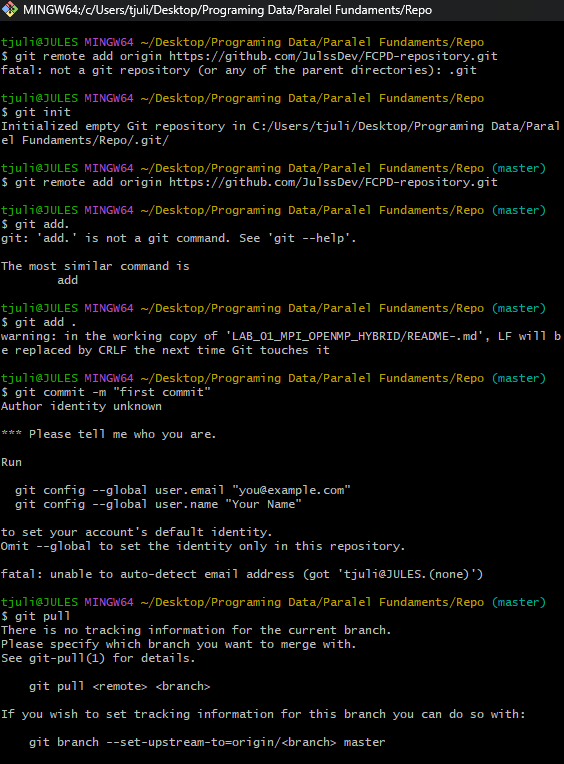
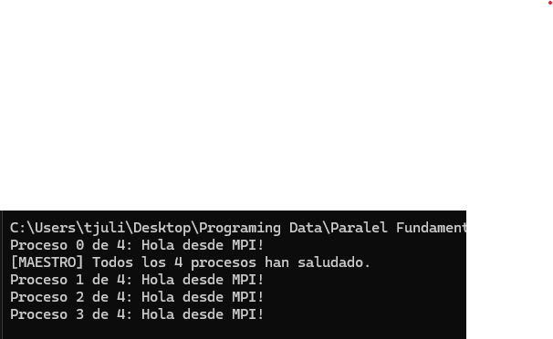
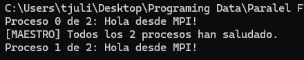
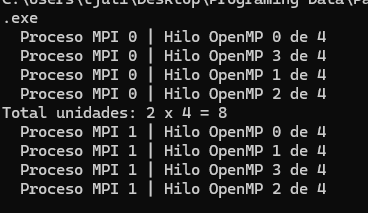
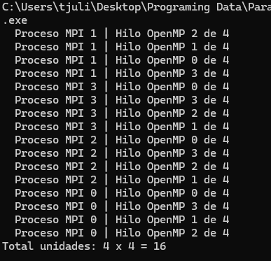

# LAB-01-MPI-OPENMP-HYBRID | Nombre Persona A & Nombre Persona B

> **Asignatura:** Fundamentos de Programación Concurrente y Distribuida  
> **Docente:** Prf. Alejandro Jaimes  
> **Fecha:** 07/05/2026  
> **Repositorio:** [FCPD-repository](https://github.com/JulssDev/FCPD-repository)

---

## Equipo

| | Colaborador | GitHub |
|---|---|---|
| 👤 | Julio Martinez Triana | [@JulssDev](https://github.com/JulssDev) |
| 👤 | Andres David Cuadrado | [@Datians](https://github.com/Datians) |

**Repositorio:** [computacion-paralela-distribuida](https://github.com/usuario_a/computacion-paralela-distribuida)  
**Rama principal:** `main`

## Configuración del repositorio

### Clonar
```bash
git clone https://github.com/usuario_a/computacion-paralela-distribuida.git
cd computacion-paralela-distribuida
```

### Colaboradores
Para agregar al compañero como colaborador:  
`Settings → Collaborators → Add people → @usuario_b`

### Convención de commits
```
lab01: agrega ejercicio 1 hola mundo MPI
lab01: completa ejercicio 3 suma híbrida
lab02: agrega pantallazos ejercicio 2
fix:   corrige suma en mpi_03
```
**Pantallazo — Github Config:**



## Estructura de Repo
```md
computacion-paralela-distribuida/
│
├── README.md                          # Presentación del repo, integrantes, tabla de labs
│
├── laboratorios/
│   ├── lab_01_mpi_openmp_hybrid/
│   │   ├── README.md
│   │   ├── img/
│   │   │   ├── ej1_4procesos.png
│   │   │   └── ...
│   │   ├── mpi_01_hola.c
│   │   ├── mpi_02_hibrido.c
│   │   ├── mpi_03_suma_hibrida.c
│   │   └── mpi_04_speedup.c
│   │
│   ├── lab_02_xxxxx/
│   │   ├── README.md
│   │   ├── img/
│   │   └── *.c
│   │
│   └── lab_03_xxxxx/
│       └── ...
│

```

## Ejercicio 1 — Hola Mundo MPI

**Descripción:** Cada proceso MPI imprime su rank y el total de procesos. El proceso maestro (rank 0) imprime un mensaje adicional al final.

**Compilación y ejecución:**
```bash
mpicc mpi_01_hola.c -o mpi_01_hola.exe
mpiexec -n 4 .\mpi_01_hola.exe
mpiexec -n 2 .\mpi_01_hola.exe
```

**Pantallazo — 4 procesos:**



**Pantallazo — 2 procesos:**



**Respuestas a las preguntas de análisis:**

1. **¿Por qué el orden de salida varía entre ejecuciones?** 
Ya que se ejecuta en paralelo, no existe un orden de salida, el primer proceso que se ejecuta es aleatorio. El sistema operativo decide cuándo cada proceso usa el CPU, a esto le podemos llamar no determinismo en la ejecución paralela. 

2. **¿Qué pasaría si ejecutas con `-n 1`?**  
Se ejecuta un solo proceso, podemos decir que no tiene mucho sentido paralelizar asi el codigo para simplemente correr un solo proceso.

3. **¿Para qué sirve `MPI_COMM_WORLD`?**  
Es practicamente un comunicador en donde todos los procesos estan incluidos y todo estos pueden comunicarse entre si.

---

## Ejercicio 2 — OpenMP dentro de MPI

**Descripción:** Dentro de cada proceso MPI se lanza una región paralela OpenMP con 4 hilos. Cada hilo imprime su ID junto con el rank del proceso que lo contiene. Al final, el maestro calcula el total de unidades de cómputo activas.

**Compilación y ejecución:**
```bash
mpicc -fopenmp mpi_02_hibrido.c -o mpi_02_hibrido.exe
mpiexec -n 2 .\mpi_02_hibrido.exe
mpiexec -n 4 .\mpi_02_hibrido.exe
```

**Pantallazo — 2 procesos MPI × 4 hilos:**



**Pantallazo — 4 procesos MPI × 4 hilos:**



**Respuestas a las preguntas de análisis:**

1. **Con 2 procesos MPI y 4 hilos OMP, ¿cuántas unidades de cómputo hay?**  
2 x 4 = 8 unidades de computo.

2. **¿Diferencia entre `-n 4` (4 MPI, 4 hilos) vs `-n 1` (1 MPI, 16 hilos)?**  
1 MPI y 16 hilos ocurre todo en un solo proceso al contrario del otro, aparte que isa memoria compartida al contrario del otro que usa memoria distribuida.

3. **¿Por qué `MPI_Init_thread` en lugar de `MPI_Init`?**  
Ya que se usan hilos con OpenMP es necesario inicializar el programa de esa manera, si se inicializa solo con MPI_Init tiene riesgo de generar errores raros o race conditions.

---

## Ejercicio 3 — Suma Híbrida de Vector

**Descripción:** El proceso maestro inicializa un vector...
**Compilación y ejecución:**
```bash
mpicc -fopenmp mpi_03_suma_hibrida.c -o mpi_03.exe
mpiexec -n 4 .\mpi_03.exe
```

**Pantallazo — resultado:**


**Verificación:**
```
Suma total = 499999500000
Esperado   = 499999500000  ✓
```

**Respuestas a las preguntas de análisis:**

1. **¿Qué hace exactamente `MPI_Scatter`?**  
  

2. **¿Por qué `reduction(+:suma_local)` y no una variable compartida?**  
  

3. **¿Qué pasaría si olvidaras `MPI_Reduce` e imprimieras `suma_local` en rank 0?**  
   

---

## Ejercicio 4 (Reto) — Speedup Híbrido

**Descripción:** Se añade medición de tiempos con `MPI_Wtime()` al Ejercicio 3 para...

**Compilación:**
```bash
mpicc -fopenmp mpi_04_speedup.c -o mpi_04.exe
```

**Tabla de resultados:**

| Configuración   | Procesos MPI | Hilos OMP | Tiempo (s) | Speedup |
|-----------------|:------------:|:---------:|:----------:|:-------:|
| Secuencial      | 1            | 1         | 1.2340 s   | 1.00×   |
| Solo MPI        | 4            | 1         | 0.3980 s   | 3.10×   |
| Solo OMP        | 1            | 4         | 0.4120 s   | 2.99×   |
| MPI + OMP       | 2            | 2         | 0.3510 s   | 3.51×   |
| MPI + OMP       | 4            | 2         | 0.2180 s   | 5.66×   |

**Pantallazos:**


**Análisis:**

1. **¿Coincide con la Ley de Amdahl?**  
   

2. **¿Por qué más procesos/hilos no siempre dan mayor speedup?**  
   

3. **¿Qué overhead introduce MPI que no existe en OpenMP puro?**  
   

---

## Conclusiones

**Añadir minimo 4-5** conclusiones.
